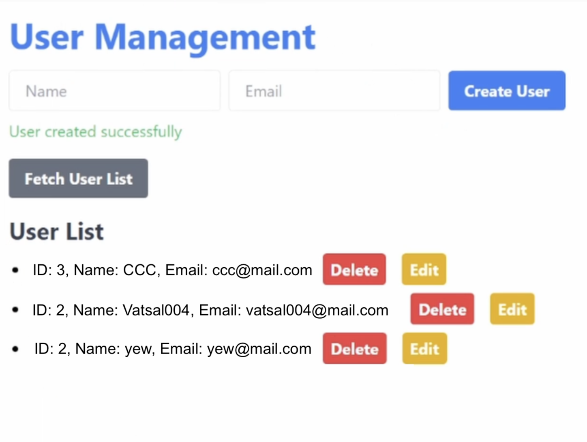

# Full-Stack Rust Web Application

This is a simple full-stack web application built using Rust for both the frontend and backend. The application includes a frontend built with Yew, a backend using Rocket, and a PostgreSQL database running in Docker.

## Features

- **Fetch Users**: View a list of users from the database.
- **Update User**: Update an existing user by modifying their name and email.
- **Delete User**: Remove a user from the database.

## Technologies Used

- **Frontend**:
  - **Rust**: Core programming language
  - **WebAssembly**: For running Rust in the browser
  - **Yew**: Rust framework for building client web apps
  - **Trunk**: For serving the frontend app
  - **Tailwind CSS**: For styling

- **Backend**:
  - **Rust**: Core programming language
  - **Rocket**: Rust framework for building web servers

- **Database**:
  - **PostgreSQL**: Relational database
  - **Docker**: For running PostgreSQL in a container

## Prerequisites

Before starting, ensure you have the following installed:

- [Rust](https://www.rust-lang.org/tools/install)
- [Docker](https://www.docker.com/get-started)

## Backend Setup

1. Start the Rocket backend:

   ```bash
   cargo run
   ```

2. Start the PostgreSQL database with Docker Compose:

   ```bash
   docker compose up
   ```

   To interact with the database, you can access the container:

   ```bash
   docker exec -it db psql -U postgres
   ```

   Example commands to interact with the database:

   ```sql
   \dt
   select * from users;
   ```

## Frontend Setup

1. Build the frontend for WebAssembly:

   ```bash
   cargo build --target wasm32-unknown-unknown
   ```

2. Serve the frontend with Trunk:

   ```bash
   trunk serve
   ```

- To build WebAssembly, you may need to install the target:

  ```bash
  rustup target add wasm32-unknown-unknown
  ```

- Install Trunk for frontend build:

  ```bash
  cargo install trunk
  ```
  

## Access the Application

Visit `http://127.0.0.1:8080` to interact with the app.

<p align="left">
  
</p>
